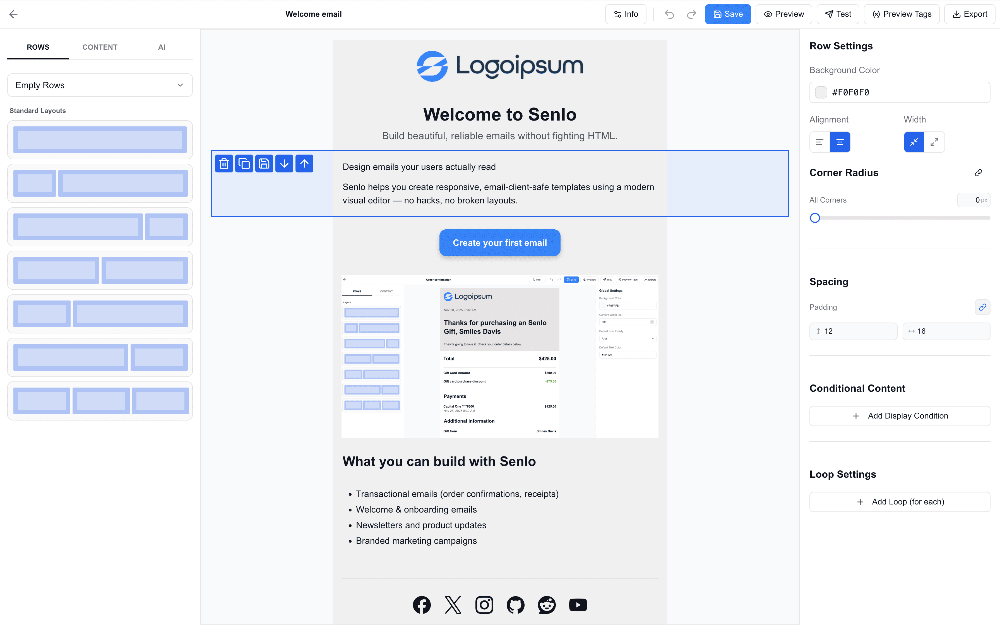
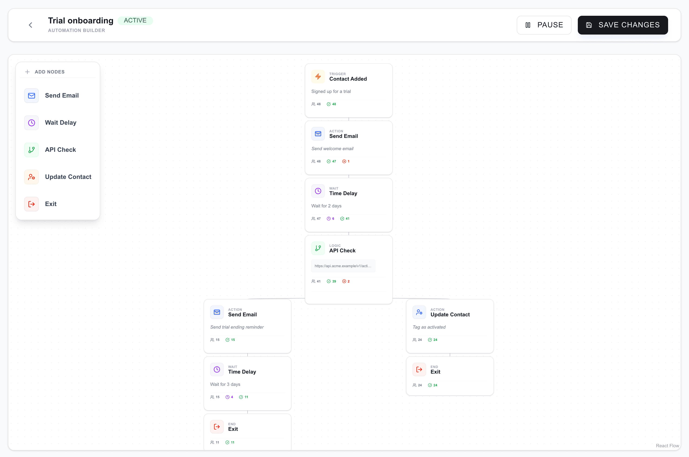
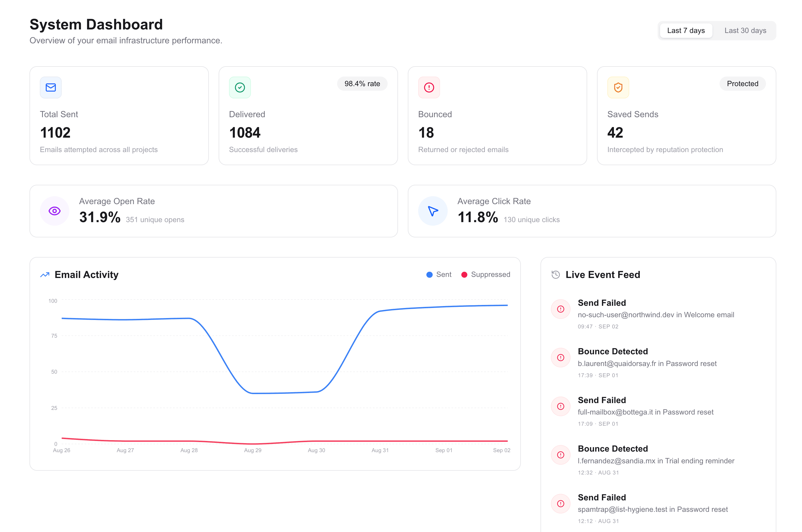
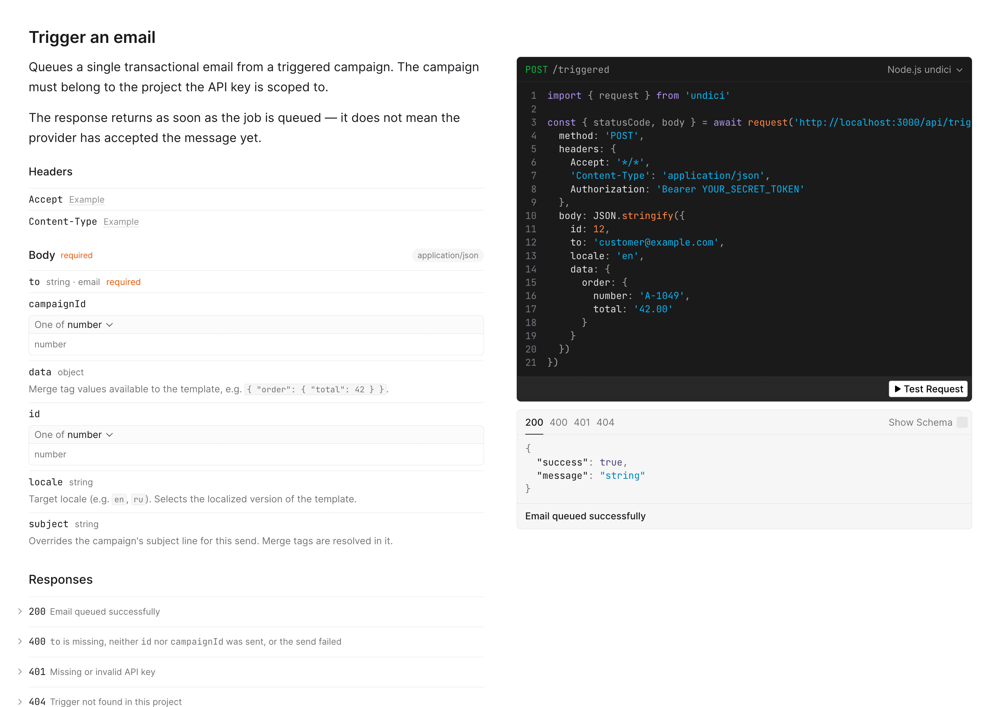

<p align="center">
  
</p>

# Senlo — Infrastructure for Transactional & Lifecycle Emails

Senlo is an open-source, developer-first email infrastructure designed to handle the entire lifecycle of your product's emails. It provides the tools to build, manage, and deliver transactional and lifecycle emails without being locked into a specific delivery provider.

<p align="center">
  
</p>

## Quick Start

Run a full Senlo instance locally. Docker is the only requirement.

```bash
git clone https://github.com/IgorFilippov3/senlo.git
cd senlo/deploy/vps
cp env.example .env
sed -i.bak "s|YOUR_AUTH_SECRET_HERE|$(openssl rand -base64 32)|" .env && rm .env.bak
docker compose up -d --build
```

The first build compiles the app from source and takes a few minutes. When it finishes, open **http://localhost:3000** and create an account — you land in an example project with four ready-made templates you can open in the visual editor right away.

To start sending, add your email provider credentials (Resend or Postmark) on the **Providers** page. The interactive API reference lives at **`/api-docs`** on your own instance.

For a production setup on a server, see the [VPS Deployment Guide](./deploy/vps/README.md).

## Why Senlo?

Most email platforms are built for marketing teams, bundling editing, sending, and analytics into closed ecosystems. Senlo is built for **developers and product teams** who need:

- **Full Control**: Self-host your email infrastructure and keep your data on your own servers.
- **Provider Agnostic**: Switch between AWS SES, Resend, Mailgun, or SMTP without changing your code.
- **Visual & Code**: A powerful drag-and-drop builder for designers, with a clean API for developers.
- **Lifecycle Management**: Manage everything from password resets to complex automated onboarding sequences.

## Key Capabilities

- **Visual Drag-and-Drop Editor**: Build beautiful, responsive templates without writing HTML/MJML.
- **API-First Approach**: Trigger emails, manage contacts, and track events via a robust REST API.
- **Dynamic Personalization**: Use merge tags and conditional logic to tailor content for every recipient.
- **Template Versioning**: Track changes and roll back to previous versions of your email designs.
- **Multi-Project Isolation**: Manage multiple products or environments (Staging/Production) from a single instance.

## Automations that branch on your own data

Drag out a journey on the canvas: send an email, wait, then ask **your** API whether the user did the thing, and take a different path depending on the answer. Every node shows how many people are sitting in it right now and how many have moved on.

<p align="center">
  
</p>

## Delivery you can actually see

Sends, deliveries, bounces and engagement for every project, plus a live feed of what went wrong and who was suppressed before a bad address could damage your sending reputation.

<p align="center">
  
</p>

## An API, not a black box

Two endpoints do the work: `POST /api/triggered` sends one transactional email from a template, and `POST /api/events` feeds contact events into your automations. Every instance serves its own interactive reference at `/api-docs`.

<p align="center">
  
</p>

## Use Cases

- **Transactional Emails**: Reliable delivery for password resets, receipts, and verification codes.
- **Product Lifecycle**: Automated onboarding series, feature announcements, and re-engagement campaigns.
- **Embedded Editor**: Integrate the visual builder directly into your own SaaS product.

## Status

Senlo is currently in active development (MVP stage). We are stabilizing the API and adding core features. Contributions and feedback are welcome!

Check out our [Roadmap](ROADMAP.md) for planned features and upcoming improvements.

## Author

**Igor Filippov**

- GitHub: [@IgorFilippov3](https://github.com/IgorFilippov3)
