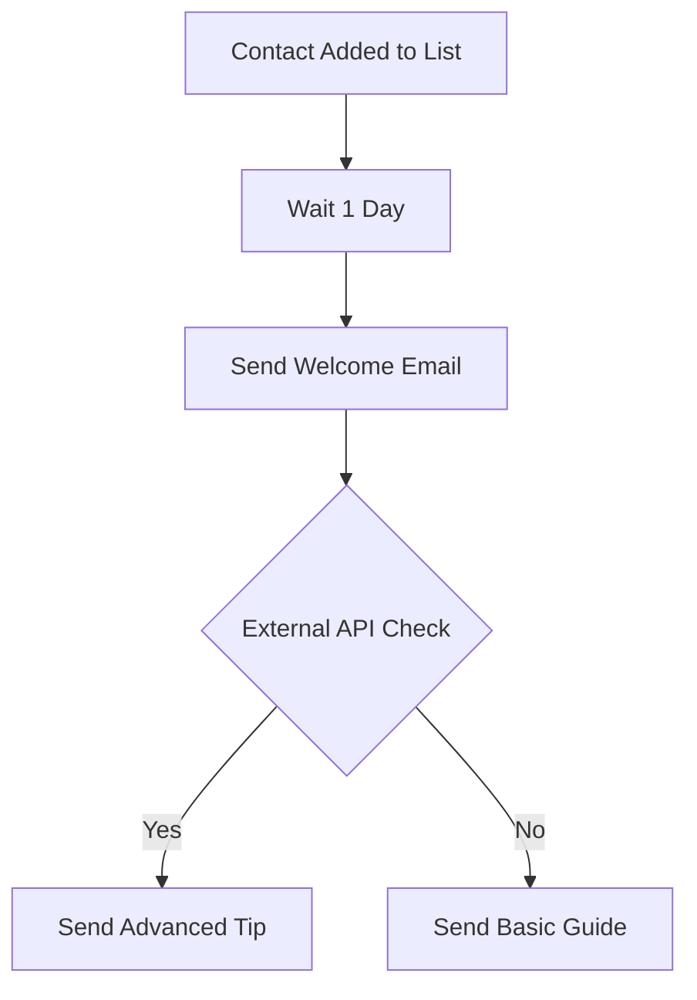

# Visual Automation Builder Plan

Implement a visual drag-and-drop workflow editor using React Flow and a backend automation engine powered by BullMQ to handle lifecycle email sequences.

## Architectural Overview

The Visual Automation Builder will consist of three main parts:

1.  **Database Layer**: New tables to store workflows, their nodes/edges, and execution state.
2.  **Automation Engine**: A service that listens for triggers and manages the flow of contacts through steps using BullMQ.
3.  **Visual Editor UI**: A Next.js-based drag-and-drop canvas using `reactflow` for building sequences.

## 1. Database Schema (`packages/db/src/schema.ts`)

Add the following tables:

- `workflows`: Stores the workflow metadata (name, status, project_id).
- `workflow_nodes`: Stores individual steps (triggers, actions, delays) with their configuration and UI position.
- `workflow_edges`: Stores the connections between nodes.
- `workflow_executions`: Tracks a contact's journey through a workflow.
- `workflow_step_executions`: Tracks the current state of a contact at a specific node (important for delays).

## 2. Automation Engine (`packages/core/src/services/automationService.ts`)

- **AutomationService**: Handles CRUD for workflows and provides methods to trigger them.
- **Workflow Runner**: Processes steps. When a step completes, it finds the next nodes via `workflow_edges` and schedules them.
- **Queue Integration**: Create an `automation-queue` in BullMQ.
- **Delay Support**: Use BullMQ's `delay` option for "Wait" steps.

## 3. Visual Editor (`apps/web/app/(app)/workspace/[id]/automations`)

- **Canvas**: Implement a `WorkflowEditor` component using `reactflow`.
- **Node Types**:
  - `TriggerNode`: Entry points (e.g., "Contact Added to List").
  - `ActionNode`: Operations like "Send Email" (selects an existing template).
  - `DelayNode`: Time-based waits.
  - `ConditionNode`: Logic gates based on **External API checks** (calls a user-provided URL and decides path based on JSON response).
- **Side Panel**: Node configuration UI using existing Radix UI components.

## 4. API Condition Contract

To keep the system flexible, the `ConditionNode` will expect a simple contract from the user's API:

- **Request**: POST with contact metadata (email, etc.) and custom variables.
- **Response**: A JSON object, e.g., `{"result": boolean, "data": {...}}`.
- **Logic**: The user defines which JSON path to check (e.g., `$.result === true`).

## 5. Integration Points

- **Audience Service**: Call `automationService.trigger('contact_added', ...)` when a new contact is created.
- **Campaigns/Templates**: Action nodes will reference existing email templates.

## Workflow Example

## To-Do List

- [x] Define database schema for workflows, nodes, edges, and executions
- [x] Implement AutomationService and Workflow Runner logic in `packages/core` (including External API check handler)
- [x] Configure BullMQ `automation-queue` and worker in `packages/core`
- [x] Integrate automation triggers into existing `AudienceService`
- [x] Create Visual Automation Builder UI foundation in `@senlo/automation-builder` using React Flow
- [x] Create Visual Automation Builder pages and components in `apps/web`
- [x] Add CRUD operations for workflows in the web app dashboard
- [ ] Implement side panel for node configuration (email selection, delay settings, etc.)
- [ ] Add analytics/stats overlays to the canvas nodes
